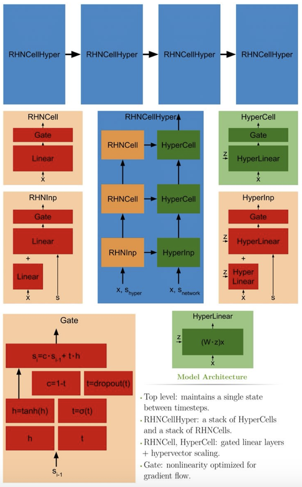

# Recurrent Highway Hypernetworks

***Link to original paper:*** https://papers.nips.cc/paper/6919-language-modeling-with-recurrent-highway-hypernetworks.pdf

## Brief Summary

Recurrent Highway Hypernetworks (RHNCellHyper) are the modification of Recurrent Highway Networks (RHN) cells that combines it with hypernetworks. The experiments results suggested that the architecture makes an improvement on character-level language modelling on much simpler regularization.

## Introduction

### Background

- Recurrent neural networks architectures still suffer from vanishing gradients problem, even LSTM and GRU
- One approach to solve the gradient flow is batch normalization, but it does not solve the problem entirely and also imposes significant overhead in memory and thus in performance, given the efficiency of parallelization over minibatches
- Recurrent Highway Networks offered a robust theoretical support to solve the gradient flow problem.
- Hypernetworks can be introduced as a mechanism for allowing weight drift between timesteps, and this is a very desirable consideration. given the successes of recent convolutional architectures on language modeling tasks

### Contributions

- The utility of RHNs and hypernetworks, both individually and jointly, in constructing improved recurrent architectures.

## Model

### Recurrent Highway Networks

**Note: as much as I enjoy the paper, I do think that the original paper presents the equations better*

First, consider GRU notation

![alt text][eq1]

One layer RHN cell is a simplified GRU variant,

![alt text][eq2]

Multiple layer RHN cell notation would look as such:

![alt text][eq3]

### Hypernetwork

Hypervector `z` as a linear upscaling projection applied to the outputs of a small recurrent network defined as such:

![alt text][eq4]

where, `W_p` is an upscaling projection from dimension `h` to `n` and `h<<n`. The hypervector will then be used to upscale the main recurrent network weights by:

![alt text][eq5]

As this constitutes a direct modification of the weights, hypernetworks have the interpretation of relaxing the weight sharing constraint implicit in RNNs.

### Recurrent Highway Hypernetwork

By combining the RHN and hypernetwork, RHNCellHyper looks as such:

![alt text][eq6]

The hypernetwork is much smaller than the main network by design, hence upscaling occurs between the networks. The final architecture at each timestep for layer `l` can thus be written:

![alt text][eq7]

The model blueprint (taken from the paper poster):

<p align="center">
  
</p>

## Code

**Note: taken from the open-sourced code*

*link: https://github.com/jsuarez5341/Recurrent-Highway-Hypernetworks-NIPS*

```
import torch
import torch.nn as nn
import torch.optim as optim
import torch.nn.functional as F
from torch.autograd import Variable

def highwayGate(Ws, s, gateDrop, trainable):
   h = int(Ws.size()[1]/2)
   hh, tt  = t.split(Ws, h, 1)
   hh, tt = F.tanh(hh), F.sigmoid(tt) 
   cc = 1 - tt
   tt = F.dropout(tt, p=gateDrop, training=trainable)
   return hh*tt + s*cc

class HyperLinear(Module):
    def __init__(self, in_features, out_features):
        super(HyperLinear, self).__init__()
        self.in_features = in_features
        self.out_features = out_features
        self.weight = Parameter(torch.Tensor(out_features, in_features))
        self.bias = Parameter(torch.Tensor(out_features))
        self.reset_parameters()

    def reset_parameters(self):
        stdv = 1. / math.sqrt(self.weight.size(1))
        self.weight.data.uniform_(-stdv, stdv)
        if self.bias is not None:
            self.bias.data.uniform_(-stdv, stdv)

    def forward(self, input, z):
        weight = self.weight
        z = torch.cat((z,z), 1)
        Wx = self._backend.Linear()(input, weight)*z
        Wx += self.bias.expand_as(Wx) 
        return Wx

    def __repr__(self):
        return self.__class__.__name__ + ' (' \
            + str(self.in_features) + ' -> ' \
            + str(self.out_features) + ')'

class RHNCell(nn.Module):
   def __init__(self, embedDim, h, depth, gateDrop):
      super(RHNCell, self).__init__()
      self.h, self.depth, self.gateDrop = h, depth, gateDrop
      self.inp  = nn.Linear(embedDim, 2*h)
      self.cell = nn.ModuleList([
            nn.Linear(h, 2*h) for i in range(depth)])

   def forward(self, x, s, trainable):
      sOut = []
      for l in range(self.depth):
         Ws = self.cell[l](s) if s is not 0 else 0
         if l == 0:
            Ws += self.inp(x) 
         s = highwayGate(Ws, s, self.gateDrop, trainable)
         sOut += [s]
      return s, s, sOut

class HyperCell(nn.Module):
   def __init__(self, embedDim, h, depth, gateDrop):
      super(HyperCell, self).__init__()
      self.h, self.depth, self.gateDrop = h, depth, gateDrop
      self.inp  = HyperLinear(embedDim, 2*h)
      self.cell = nn.ModuleList([
            HyperLinear(h, 2*h) for i in range(depth)])

   def forward(self, x, s, z, trainable):
      sOut = []
      for l in range(self.depth):
         Ws = self.cell[l](s, z[l]) if s is not 0 else 0
         if l == 0:
            Ws += self.inp(x, z[l])
         s = highwayGate(Ws, s, self.gateDrop, trainable)
         sOut += [s]
      return s, sOut

class HyperRHNCell(nn.Module):
   def __init__(self, embedDim, h, depth, gateDrop):
      super(HyperRHNCell, self).__init__()
      hHyper, hNetwork = h
      self.HyperCell = RHNCell(embedDim, hHyper, depth, gateDrop)
      self.RHNCell   = HyperCell(embedDim, hNetwork, depth, gateDrop)
      self.upscaleProj = nn.ModuleList([nn.Linear(hHyper, hNetwork) 
            for i in range(depth)])

   def initializeIfNone(self, s):
      if s is not 0: return s
      return (0, 0)
 
   def forward(self, x, s, trainable):
      sHyper, sNetwork = self.initializeIfNone(s)
      _, _, sHyper = self.HyperCell(x, sHyper, trainable)
      z = [self.upscaleProj[i](e) for i, e in enumerate(sHyper)]
      out, sNetwork = self.RHNCell(x, sNetwork, z, trainable)
      return out, (sHyper[-1], sNetwork[-1]), (sHyper, sNetwork)
```


[eq1]: assets/eq1.png
[eq2]: assets/eq2.png
[eq3]: assets/eq3.png
[eq4]: assets/eq4.png
[eq5]: assets/eq5.png
[eq6]: assets/eq6.png
[eq7]: assets/eq7.png
[RHHN-blueprint]: assets/RHHN-blueprint.png
