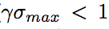
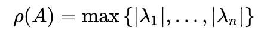

# Recurrent Highway Networks

***Link to original paper:*** https://arxiv.org/pdf/1607.03474.pdf

## Brief Summary

Recurrent Highway Networks (RHNs) are the extension of Long Short Term Memory (LSTM) cells that allows step-to-step transition depths to be larger than one. Experiments confirmed the theoretical optimization advantages as well as improved performance on well known sequence modeling tasks.

## Introduction

### Background

- Network depth is an important element in the rise of deep learning as a powerful learning algorithm. However, **increased depth imposed a problem** when neural network parameters are optimized by the means of error via backpropagation.
- **Vanishing and exploding gradient** problems may occur due to the magnitude of the gradient that may sink or become exponentially too big during backpropagation.
- LSTM cell was introduced to specifically address those problems in RNNs.
- Highway Layer was also introduced to solve vanishing gradient problem in a very deep nets architecture.

### Contributions

- Mathematical Analysis of RNN and LSTM strengths
- RHNs as the variation of LSTM with long credit assignment paths in time and in space (per time step)
- SoTA on widely used benchmarks

## Related Works

- Training stacked RNNs naturally requires credit assignment
across both space and time which is difficult in practice
- Pascanu et al. (2013) proposed to increase the recurrence depth by adding multiple non-linear layers to the recurrent transition, resulting in Deep Transition RNNs (DT-RNNs) and Deep Transition RNNs with Skip connections (DT(S)-RNNs)

![alt text][DT-RNNs]

- Stacking `d` RNN layers allows a maximum credit assignment path length (number of non-linear transformations) of `d + T − 1` between hidden states which are `T` time steps apart, while a recurrence depth of `d` enables a maximum path length of `d × T`.
- The latter allows greater power and efficiency by adding larger depths, but it also explains why such it is much more difficult to train compared to stacked RNNs

## Model

### Recurrent Network Gradient Flow

#### Overview of Vanishing and Exploding Gradient Problems

The derivative of the loss L with respect to parameters θ of
a network can be expanded using the chain rule:

![alt text][eq1]

The Jacobian matrix ```∂y[t2]/∂y[t1]```, the key factor for the transport of the error from time step t2 to time step t1, is obtained by chaining the derivatives across all time steps:

![alt text][eq2]

the input and bias are omitted for simplicity. Let `A` be the temporal Jacobian matrix, `γ` be a maximal bound on `f'(Ry^[t−1])` and `σ_max` be the largest singular value of `R^T`. The norm of Jacobian satisfies:

![alt text][eq3]

Which means, the condition for vanishing gradient:

<p align="center">
  
</p>

On the other hand, exploding gradient will emerge if the spectral radius `ρ` of `A` is greater than 1 since `||A|| ≥ ρ`. Note to self:

<p align="center">
  
</p>

#### Gershgorin Circle Theorem

For any square matrix `A`:

![alt text][eq4]

Two example Gershgorin circles referring to differently initialized RNNs:

![alt text][fig-gct]

GCT helps us understand the relationship between the entries of `R` and the possible locations of the eigenvalues of the Jacobian. Shifting the diagonal values `a_ii` shifts the possible locations of eigenvalues. Having large off-diagonal entries will allow for a large spread of eigenvalues. Small off-diagonal entries yield smaller radii and thus a more confined distribution of eigenvalues around the diagonal entries `a_ii`.

### Recurrent Highway Networks

RHN layer with recurrence depth of `L` is defined as:

![alt text][eq6]

where,

![alt text][eq7-9]

The computation graph can be illustrated as:

![alt text][RHN]

From Equation 7-9, we can conclude that RHN with `L=1` is essentially a basic variant of LSTM like GRU. 

By omitting the input and bias, the temporal jacobian `A` of RHN is given by:

![alt text][eq10]

where,

![alt text][eq11-13]

and the spectrum will be:

![alt text][eq14]

Equation 14 captures the influence of the gates on the eigenvalues of A. Compared to the situation for standard RNN, it can be seen that an RHN layer has more flexibility in adjusting the centers and radii of the Geršgorin circles. In
particular, two limiting cases can be noted. If all carry gates are fully open and transform gates are fully closed, we have:

![alt text][eq15]

Modelling Conclusion taken from Geršgorin circle theorem (GCT):

- The gates in RHN layers provide a more versatile setup for dynamically remembering, forgetting and transforming information compared to standard RNNs.
- Highly non-linear gating functions can facilitate learning through rapid and precise regulation of the network dynamics.
- Depth is a widely used method to add expressive power to functions, this paper extends RHN layers to L > 1 using Highway layers in favor of simplicity and ease of training.
- The analysis of the RHN layer’s flexibility in controlling its spectrum furthers our theoretical understanding of LSTM and Highway networks and their variants.

### Experiments

Reading the paper is better, but the takeaway of the implementation is:

- Carry gate was coupled to the transform gate by setting `C(·) = 1n − T(·)`. Similar to the suggestion from Highway Network and similar to GRU
- Bias the transform gates towards being closed at the start of training
- Variational dropout (RHNs that use this reffered as Variational RHNs) == `recurrent_dropout` in keras
- SGD optimizer

## Code

```
import torch
import torch.nn as nn
import torch.optim as optim
import torch.nn.functional as F
from torch.autograd import Variable

class StateTransition (nn.Module):
    def __init__(self, in_feat, out_feat):
        super(StateTransition, self).__init__()
        self.linear_x = nn.Linear(in_feat, out_feat, bias=False)
        self.linear_s = nn.Linear(out_feat, out_feat, bias=True)

    def forward(self, x, s):
        return self.linear_x(x) + self.linear_s(s)

class RecurrentHighwayNetwork (nn.Module):
    def __init__(self, in_feat, out_feat, depth):
        super(RecurrentHighwayNetwork, self).__init__()
        self.H = nn.ModuleList([StateTransition(in_feat, out_feat) for i in range(depth)])
        self.T = nn.ModuleList([StateTransition(in_feat, out_feat) for i in range(depth)])
        
    def forward(self, seq, s):
    	sOut = []
	for x in seq:
	    for h, t in zip(self.H, self.T):
		transform_gate = F.sigmoid(t(x, s))
		s = F.tanh(h(x, s)) * transform_gate + s * (1 - transform_gate)
		sOut += [s]
	return s, sOut
```


[DT-RNNs]: assets/2-Figure1-1.png
[eq1]: assets/eq1.png
[eq2]: assets/eq2.png
[eq3]: assets/eq3.png
[eq3sup]: assets/eq3sup.png
[eq-spectral-radius]: assets/spectral-radius-eq.png
[eq4]: assets/eq4.png
[fig-gct]: assets/fig-gct.png
[eq5]: assets/eq5.png
[eq6]: assets/eq6.png
[eq7-9]: assets/eq7-9.png
[eq10]: assets/eq10.png
[eq11-13]: assets/eq11-13.png
[eq14]: assets/eq14.png
[eq15]: assets/eq15.png
[RHN]: assets/5-Figure3-1.png
